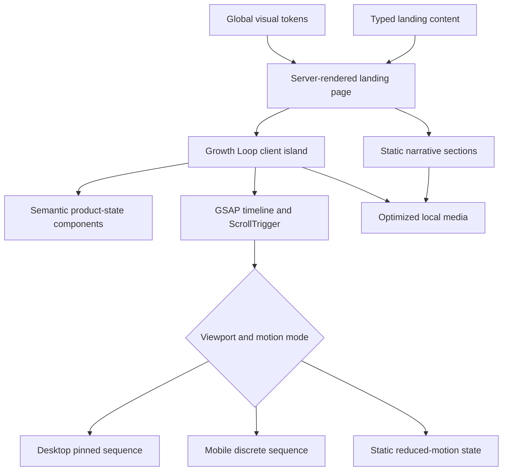
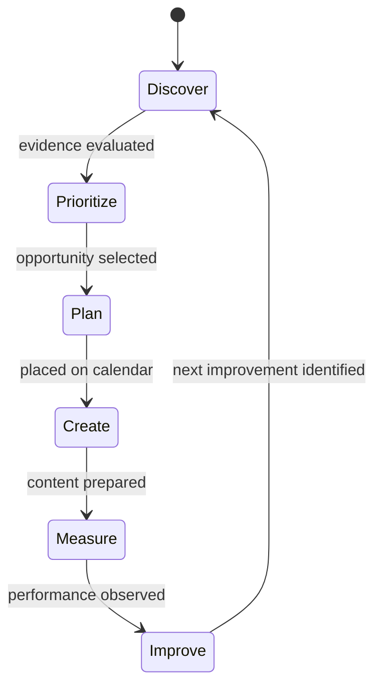

# Project Rankup Landing Page - Plan

## Goal Capsule

- **Objective:** Visitors understand that Project Rankup turns visibility into business growth, see how its connected workflow supports that outcome today, and can confidently start the Free plan.
- **Means:** Build a premium Next.js landing page around the approved seven-section narrative and The Growth Loop motion system (KTD1-KTD6).
- **Authority:** The approved hero and decisions in `docs/landing/decision-log.md` outrank earlier alternatives; the remaining `docs/landing/` artifacts supply content, product truth, visual direction, and asset constraints.
- **Stop condition:** Stop before implementation invents Agent Mode behavior, uses research screenshots as production assets, or publishes unsupported claims.
- **Execution profile:** Greenfield code implementation in the current repository; the implementing agent completes local verification but does not publish or deploy without separate authorization.

---

## Product Contract

### Summary

Create a compact, premium landing page that leads with the outcome “Turn visibility into growth,” then explains Project Rankup through one connected organic-growth workflow. The page should feel substantial enough for the $249/month Pro and $499/month Enterprise positioning while remaining concise, product-led, and honest about current versus future capabilities.

### Problem Frame

The current public positioning operates one abstraction layer below the buyer’s desired outcome. SEO, keyword research, content production, and organic growth explain how Project Rankup works, but buyers ultimately want their businesses to be discovered and to turn that visibility into growth. The new page must communicate that outcome quickly, prove it through the current product, and preserve expansion room for future discovery surfaces without implying they already exist.

### Key Decisions

- **Visibility -> growth is the hero outcome.** (session-settled: user-directed — chosen over leading with organic growth or a connected SEO system: customers care first about discovery, qualified traffic, and business growth.) Governs R1-R3.
- **The Growth Loop explains the system.** (session-settled: user-directed — chosen over separate feature sections: the product should read as one connected workflow.) Governs R4-R7.
- **Linear leads the visual direction.** (session-settled: user-directed — chosen over Squarespace as the primary reference: the page should feel product-led, technical, restrained, and premium.) Governs R8-R10.
- **Agent Mode remains future-facing.** (session-settled: user-directed — chosen over depicting speculative agent behavior: Agent Mode is not implemented.) Governs R11-R12.
- **The page stays compact.** (session-settled: user-directed — chosen over translating the full outline into many large sections: substance should come from composition and interaction.) Governs R13.
- **Research screenshots are evidence only.** (session-settled: user-directed — chosen over cleaning or cropping the supplied captures: production visuals must be purpose-built.) Governs R14-R15.

### Requirements

**Hero and narrative**

- R1. The hero eyebrow must read “The organic-growth platform.”
- R2. The hero headline must read “Turn visibility into growth.”
- R3. The hero must use the approved subheadline and the CTAs “Start free” and “See how it works.”
- R4. The page must present `Discover -> Prioritize -> Plan -> Create -> Measure -> Improve` as one continuous workflow.
- R5. The product visual immediately below the hero must explain how the workflow supports the visibility-to-growth outcome.
- R6. The same demonstration opportunity and project context must persist across the workflow states.
- R7. The Measure and Improve states must visibly close the loop by producing the next opportunity or improvement signal.

**Visual quality and motion**

- R8. The visual system must be restrained, technical, approachable, and product-led, with authentic interface detail as the primary proof.
- R9. The page must use one major Growth Loop motion sequence and no more than one secondary explanatory motion moment.
- R10. Decorative animation patterns such as universal fade-ups, floating blobs, looping gradients, random parallax, and cursor theater must not be used.

**Product truth and trust**

- R11. Every Agent Mode reference must use the exact label “Agent Mode — Coming Soon” and future tense.
- R12. Agent Mode material must not depict or describe invented jobs, schedules, triggers, permissions, approvals, controls, or completed runs.
- R13. The homepage must use roughly seven major visual sections and avoid a wall of feature cards.
- R14. Supplied research screenshots must not be shipped as page assets.
- R15. Product visuals must be purpose-built from approved current product states and a consistent demo project.
- R16. The supplied Taggd and JaipurStuffs testimonials may be used verbatim without strengthening their claims.
- R17. Unsupported quantitative claims must not appear.
- R18. The page must not imply direct CMS publishing or autonomous execution exists today.
- R19. Full pricing must not become a major homepage section; CTAs may reference the confirmed Free plan.

**Responsive, accessible, and performant behavior**

- R20. Desktop and mobile compositions must preserve readable product detail without shrinking desktop dashboards into illegible images.
- R21. Reduced-motion users must receive a complete static or discrete-state Growth Loop presentation with equivalent meaning.
- R22. Keyboard navigation, visible focus, semantic structure, color contrast, and accessible names must cover all interactive controls.
- R23. Product media must reserve stable dimensions and load without avoidable layout shift.
- R24. The major animation must pause at a meaningful end state rather than loop continuously.

### Key Flow

- F1. Visibility-to-growth story
  - **Trigger:** A visitor lands on the homepage.
  - **Steps:** The hero states the outcome; The Growth Loop demonstrates the current workflow; Measure and Improve close the loop; Agent Mode is introduced as Coming Soon; proof and FAQ resolve trust questions; the visitor starts free.
  - **Outcome:** The visitor can distinguish what Project Rankup does today, how its parts work together, and where the product is heading.
  - **Covered by:** R1-R19.

### Acceptance Examples

- AE1. **Covers R1-R5.** Given a first-time desktop visitor, when the page loads, the approved hero is visible and the next viewport signal reveals The Growth Loop without requiring the visitor to interpret a feature grid.
- AE2. **Covers R4-R7.** Given the Growth Loop sequence, when it progresses, the same opportunity moves through all six named stages and the final improvement reconnects to the next cycle.
- AE3. **Covers R11-R12.** Given any Agent Mode mention, when a visitor reads or views it, “Coming Soon” is inseparable from the label and no speculative interface or behavior is presented as available.
- AE4. **Covers R20-R21.** Given a narrow viewport or reduced-motion preference, when the workflow is viewed, every stage and its relationships remain understandable without pinned motion or unreadable scaled UI.
- AE5. **Covers R16-R18.** Given the proof and FAQ sections, when claims are inspected, testimonials are verbatim and the page contains no unsupported metrics, CMS-publishing implication, or current autonomous-operation claim.

### Success Criteria

- A reviewer can identify the outcome, the complete Growth Loop, current product boundaries, and Agent Mode’s Coming Soon status from a single page pass.
- The visual composition supports a premium SaaS price point without relying on decorative effects or excessive page length.
- Desktop and mobile browser checks show no overlapping text, clipped controls, blank product states, or incoherent layout shifts.
- The animation remains smooth on representative desktop and mobile emulation and degrades to an equally legible reduced-motion state.

### Scope Boundaries

**In scope**

- One production-quality Next.js homepage.
- Purpose-built marketing representations of the approved current product states.
- The Growth Loop and one restrained secondary motion treatment.
- Navigation, testimonials, Agent Mode — Coming Soon, FAQ, and final CTA.
- Metadata, responsive behavior, accessibility, performance work, and browser validation.

**Deferred to follow-up work**

- Real application integration or live product data.
- CMS publishing, account creation, authentication, billing, and checkout flows.
- A dedicated pricing page or expanded pricing comparison.
- Analytics, experimentation, consent management, and production deployment.
- New product screenshots captured from an application repository when access becomes available.

**Out of scope**

- Product information-architecture redesign.
- Implementation or detailed design of Agent Mode.
- Reopening positioning, competitor research, or the approved hero.
- Reusing the supplied screenshots as production assets.

### Dependencies and Assumptions

- The repository has no application source, manifest, or test setup; implementation starts with a greenfield Next.js scaffold.
- The plan assumes a current stable Next.js App Router and React release at implementation time rather than pinning a version before the package manifest exists.
- `Start free` and other external destinations will be centralized in content configuration; the final URLs can be supplied without changing component structure.
- The first implementation may use purpose-built HTML/CSS product-state compositions based on the approved product truth. Live captures remain a later asset upgrade if the application becomes available.
- The primary audience remains lean teams responsible for organic growth; copy in the approved hero does not depend on a narrower vertical.

### Sources

- `docs/landing/content-outline.md`
- `docs/landing/decision-log.md`
- `docs/landing/design-research.md`
- `docs/landing/assets-needed.md`
- `docs/landing/product-understanding.md`
- `docs/landing/ux-review.md`
- [Next.js App Router documentation](https://nextjs.org/docs)
- [Next.js font and image optimization](https://nextjs.org/learn/dashboard-app/optimizing-fonts-images)
- [GSAP matchMedia documentation](https://gsap.com/docs/v3/GSAP/gsap.matchMedia%28%29/)
- [GSAP ScrollTrigger documentation](https://gsap.com/docs/v3/Plugins/ScrollTrigger/)
- [Playwright visual comparisons](https://playwright.dev/docs/test-snapshots)

---

## Planning Contract

### Key Technical Decisions

- KTD1. **Use the Next.js App Router with TypeScript and server components by default.** Interactive navigation and motion become narrowly scoped client components so the static marketing content remains lightweight and indexable. This honors the required Next.js stack while limiting hydration to behavior that needs it.
- KTD2. **Use CSS custom properties and component-scoped styles for the visual system.** Tokens live in `app/globals.css`; section components own their layout styles, avoiding a heavy design-system dependency in a single-page greenfield site.
- KTD3. **Use GSAP and ScrollTrigger only for The Growth Loop and the optional secondary transition.** Native CSS handles hover, focus, and small state changes; `gsap.matchMedia()` owns desktop, mobile, and reduced-motion branches and cleanup.
- KTD4. **Render product states as semantic React compositions backed by typed content data.** This keeps labels crisp and responsive, provides inspectable accessibility text, and lets future approved captures replace individual layers without rewriting the narrative.
- KTD5. **Keep marketing content and links in one typed configuration module.** The approved copy, testimonials, FAQs, plan facts, CTA destinations, stage labels, and current/coming-soon status remain auditable without searching presentation code.
- KTD6. **Adopt Playwright as the primary behavioral and visual verification layer.** The page is interaction-, layout-, motion-, and breakpoint-heavy; stable screenshot baselines and focused DOM assertions provide better evidence than isolated component snapshots.
- KTD7. **Treat Agent Mode as a conceptual continuation of the existing loop, not a product mock.** Solid current states transition to a restrained future trace paired with the exact Coming Soon label, satisfying R11-R12 without inventing product behavior.
- KTD8. **Keep the dependency surface narrow and version-resolve at implementation start.** Use only Next.js, React, GSAP/ScrollTrigger, Lucide icons, and Playwright unless execution uncovers a concrete gap; record exact installed versions in the generated manifest and adapt to their current official APIs.

### High-Level Technical Design





### Output Structure

```text
app/
  layout.tsx
  page.tsx
  globals.css
components/
  landing/
    site-header.tsx
    hero.tsx
    growth-loop/
      growth-loop.tsx
      growth-loop-stage.tsx
      product-states.tsx
    workflow-context.tsx
    measure-improve.tsx
    agent-mode-coming-soon.tsx
    proof.tsx
    faq.tsx
    final-cta.tsx
    site-footer.tsx
content/
  landing.ts
lib/
  motion.ts
public/
  brand/
  product/
tests/
  landing.spec.ts
  landing.visual.spec.ts
  landing.motion.spec.ts
playwright.config.ts
package.json
```

### Sequencing

1. Establish the greenfield application, global tokens, content contract, and static page skeleton.
2. Build purpose-designed product states and the complete non-animated workflow.
3. Add the desktop Growth Loop timeline, then mobile and reduced-motion modes.
4. Complete trust, Coming Soon, FAQ, metadata, and responsive polish.
5. Add browser coverage, visual baselines, performance checks, and final cross-browser validation.

### Risks and Dependencies

- **No application repository is available.** Purpose-built HTML/CSS product states can communicate the approved workflow, but they must remain faithful to `docs/landing/product-understanding.md`; live captures should replace them later if actual application access materially changes the UI.
- **Final CTA destinations are unavailable.** Centralizing links in `content/landing.ts` prevents layout coupling, but implementation cannot declare the acquisition path complete until `Start free` resolves to the real Free-plan flow.
- **Motion can dominate loading and interaction cost.** Keep GSAP outside the initial server-rendered content path, animate transforms and opacity, avoid large filter effects, and verify long tasks and layout stability in U6.
- **Visual baselines can become environment-sensitive.** Generate and review snapshots in a pinned Playwright environment, separate deterministic screenshots from motion assertions, and avoid accepting broad pixel tolerances that conceal layout regressions.
- **Marketing states can accidentally become fake product promises.** Each state must map to a documented current capability; any future-only visual belongs exclusively to the conceptual Coming Soon treatment governed by R11-R12.
- **Font and brand files remain dependencies.** Use licensed, locally hosted or `next/font`-supported assets; preserve token names so final brand files can replace provisional choices without restructuring components.

---

## Implementation Units

### U1. Scaffold the Next.js foundation and content contract

- **Goal:** Create the greenfield application foundation, metadata, typography, tokens, and a single auditable source for landing-page content.
- **Requirements:** R1-R3, R8, R16-R19, R22-R23.
- **Dependencies:** None.
- **Files:** `package.json`, `next.config.ts`, `tsconfig.json`, `app/layout.tsx`, `app/page.tsx`, `app/globals.css`, `content/landing.ts`, `tests/landing.spec.ts`, `playwright.config.ts`.
- **Approach:**
  1. Initialize the current stable Next.js App Router with TypeScript, linting, and npm scripts for development, build, lint, and Playwright.
  2. Define semantic color, type, spacing, border, elevation, motion, and container tokens in `app/globals.css`.
  3. Load approved web fonts through `next/font` and reserve stable text metrics.
  4. Put exact hero copy, testimonials, FAQs, labels, and CTA URLs in typed content data.
  5. Add title, description, canonical/Open Graph scaffolding, and favicon hooks without inventing unsupported claims.
- **Execution note:** Treat runtime startup and a production build as the first proof because this unit is primarily scaffolding.
- **Test scenarios:**
  1. Loading `/` returns the approved hero eyebrow, headline, subheadline, and both CTA labels.
  2. The page exposes one H1, a logical heading hierarchy, a skip link, and accessible navigation names.
  3. The document metadata contains the approved visibility-to-growth positioning without unsupported metrics.
  4. Missing optional media does not collapse reserved layout dimensions or prevent core copy from rendering.
- **Verification:** The development server and production build render the static hero without console errors, font layout shift, or hydration warnings.

### U2. Build the compact static page composition

- **Goal:** Implement the seven-section narrative and premium visual system before adding complex motion.
- **Requirements:** R1-R5, R8, R10, R13, R16-R19, R22.
- **Dependencies:** U1.
- **Files:** `app/page.tsx`, `components/landing/site-header.tsx`, `components/landing/hero.tsx`, `components/landing/workflow-context.tsx`, `components/landing/measure-improve.tsx`, `components/landing/agent-mode-coming-soon.tsx`, `components/landing/proof.tsx`, `components/landing/faq.tsx`, `components/landing/final-cta.tsx`, `components/landing/site-footer.tsx`, `app/globals.css`, `tests/landing.spec.ts`.
- **Approach:**
  1. Compose the seven major sections in the approved order with full-width bands and constrained inner layouts.
  2. Keep the product visible in the first viewport and leave a visible cue of The Growth Loop below the fold.
  3. Use authentic UI-density cues, fine borders, restrained indigo, and shallow depth instead of decorative feature cards.
  4. Render testimonials verbatim and keep pricing references subordinate to the main narrative.
  5. Make the secondary CTA scroll to The Growth Loop and ensure anchor navigation respects sticky-header offset.
- **Test scenarios:**
  1. **Covers AE1.** At desktop and mobile viewports, the approved hero and a visible cue of the next product section appear without overlap.
  2. The “See how it works” CTA moves focus or scroll position to The Growth Loop heading.
  3. The header remains usable at narrow widths and opens/closes navigation with keyboard and pointer input if a compact menu is needed.
  4. FAQ controls expose expanded state, remain keyboard-operable, and preserve content when JavaScript is unavailable where feasible.
  5. Testimonial text exactly matches `content/landing.ts` and no unsupported number appears in rendered page text.
- **Verification:** Every section reads as part of one story at desktop, tablet, and mobile widths; no nested-card composition or text overflow remains.

### U3. Create the purpose-built Growth Loop product states

- **Goal:** Build truthful, responsive marketing states for the same opportunity across the six-stage workflow.
- **Requirements:** R4-R7, R14-R15, R18, R20, R23.
- **Dependencies:** U1, U2.
- **Files:** `components/landing/growth-loop/growth-loop-stage.tsx`, `components/landing/growth-loop/product-states.tsx`, `components/landing/growth-loop/growth-loop.tsx`, `content/landing.ts`, `app/globals.css`, `tests/landing.spec.ts`, `tests/landing.visual.spec.ts`.
- **Approach:**
  1. Define one approved fictional demo opportunity and carry its keyword, evidence, calendar state, brief, performance, and improvement signal through every stage.
  2. Represent current product capabilities as semantic HTML/CSS interface compositions, not edited research screenshots or fake application chrome.
  3. Keep state dimensions stable so stage changes do not resize the surrounding page.
  4. Separate visible stage labels from product UI details so mobile can present a curated vertical version without shrinking desktop layouts.
  5. Mark any illustrative data internally and avoid interfaces that imply CMS publishing or autonomous execution.
- **Test scenarios:**
  1. **Covers AE2.** Every stage uses the same demo opportunity and preserves its identifying context.
  2. Stage order is exactly Discover, Prioritize, Plan, Create, Measure, Improve.
  3. The Improve state exposes a next-action signal that reconnects conceptually to Discover.
  4. At 320px width, all product labels remain readable and no state requires horizontal scrolling.
  5. Product states contain no supplied screenshot files, private domains, unsupported metrics, or CMS-publishing language.
- **Verification:** Static visual review shows a coherent product family and sufficient text legibility at the actual rendered size before motion begins.

### U4. Implement The Growth Loop motion architecture

- **Goal:** Turn the static states into one high-production motion sequence with desktop, mobile, and reduced-motion behavior.
- **Requirements:** R4-R10, R20-R24.
- **Dependencies:** U3.
- **Files:** `components/landing/growth-loop/growth-loop.tsx`, `lib/motion.ts`, `app/globals.css`, `tests/landing.motion.spec.ts`, `tests/landing.visual.spec.ts`.
- **Approach:**
  1. Keep animation ownership inside one client component and expose the active stage through semantic attributes for testing and accessibility.
  2. Build one GSAP timeline whose masks, transforms, depth, and stagger direct attention through the existing product states.
  3. Use `gsap.matchMedia()` to create independent desktop, mobile, and reduced-motion branches with automatic cleanup.
  4. Use ScrollTrigger for desktop progression without scroll-jacking; mobile uses discrete stage transitions in normal document flow.
  5. Stop at the closed-loop end state and require deliberate re-entry or reverse scroll rather than perpetual looping.
- **Test scenarios:**
  1. **Covers AE2.** Desktop scroll progression activates all six stages in order and ends with Improve linked back to Discover.
  2. Resizing across the desktop/mobile breakpoint tears down the old timeline and creates exactly one valid replacement without duplicated triggers.
  3. **Covers AE4.** With `prefers-reduced-motion: reduce`, no pinned scrub timeline runs and the complete workflow remains visible as static or discrete states.
  4. Keyboard and screen-reader users can access all stage names and descriptions without completing the animation.
  5. Reloading at a mid-page scroll position produces the correct active stage without blank or overlapping layers.
  6. The animation settles at its end state and does not restart continuously while idle.
- **Verification:** Browser inspection confirms smooth transforms, clean timeline teardown, no blank frames, no unexpected horizontal scroll, and equivalent reduced-motion meaning.

### U5. Add the Coming Soon horizon and trust closure

- **Goal:** Present Agent Mode as an exciting future direction while keeping current capabilities, proof, and limitations unambiguous.
- **Requirements:** R11-R19.
- **Dependencies:** U2, U4.
- **Files:** `components/landing/agent-mode-coming-soon.tsx`, `components/landing/proof.tsx`, `components/landing/faq.tsx`, `components/landing/final-cta.tsx`, `content/landing.ts`, `app/globals.css`, `tests/landing.spec.ts`, `tests/landing.visual.spec.ts`.
- **Approach:**
  1. Extend the visual language of The Growth Loop into a clearly conceptual future trace rather than a mock product interface.
  2. Keep “Agent Mode — Coming Soon” visually inseparable and use only the approved broad future statement.
  3. Pair the horizon with current-product proof, verbatim testimonials, and compact FAQ answers about CMS publishing and capability status.
  4. Close with the Free-plan CTA without adding a large pricing comparison section.
- **Test scenarios:**
  1. **Covers AE3.** Every rendered Agent Mode reference includes “Coming Soon” in the same accessible label or immediate context.
  2. No Agent Mode region contains task names, controls, schedules, triggers, permissions, approvals, or completed-run claims.
  3. **Covers AE5.** Testimonials render verbatim and FAQ content clearly distinguishes editorial planning from CMS publishing.
  4. The final CTA uses the configured Free-plan destination and has an accessible name.
  5. The Coming Soon treatment remains distinguishable in reduced-motion mode and without color alone.
- **Verification:** A copy audit and DOM query confirm that Agent Mode appears only in future tense and no prohibited speculative behavior or unsupported claim is present.

### U6. Complete responsive, performance, and browser validation

- **Goal:** Establish repeatable evidence that the page is polished, accessible, stable, and performant across target conditions.
- **Requirements:** R20-R24 and all acceptance examples.
- **Dependencies:** U1-U5.
- **Files:** `playwright.config.ts`, `tests/landing.spec.ts`, `tests/landing.visual.spec.ts`, `tests/landing.motion.spec.ts`, `tests/landing.visual.spec.ts-snapshots/`, `package.json`, `next.config.ts`.
- **Approach:**
  1. Configure Chromium, WebKit, and Firefox coverage with desktop and representative mobile projects.
  2. Add deterministic visual baselines for hero, static workflow states, Coming Soon, testimonials, FAQ, and final CTA.
  3. Disable or settle animation before screenshots and maintain a separate motion behavior suite.
  4. Check console errors, failed requests, focus order, overflow, image dimensions, and reduced-motion behavior.
  5. Record a production Lighthouse run or equivalent browser performance trace and address avoidable LCP, CLS, and main-thread animation costs.
- **Execution note:** Generate screenshot baselines only after layout and motion are stable, then review every baseline rather than accepting them mechanically.
- **Test scenarios:**
  1. **Covers AE1-AE5.** The complete narrative passes in Chromium at desktop and mobile widths.
  2. Critical navigation, CTA, FAQ, and reduced-motion behavior passes in Chromium, WebKit, and Firefox.
  3. Visual comparisons show no overlap, clipping, blank product states, or unintended breakpoint changes.
  4. Browser logs contain no uncaught errors, hydration warnings, or failed local asset requests.
  5. The page has no horizontal overflow at 320, 375, 768, 1024, and 1440 CSS-pixel widths.
  6. A production performance run shows no avoidable layout shift and no long-running idle animation.
- **Verification:** The production build passes all browser suites, reviewed screenshot baselines, accessibility checks, and documented performance inspection.

---

## Verification Contract

| Gate | Planned command | Applies to | Done signal |
|---|---|---|---|
| Static quality | `npm run lint` | U1-U6 | No lint or TypeScript errors |
| Production integrity | `npm run build` | U1-U6 | Next.js production build completes without warnings requiring action |
| Behavioral browser suite | `npm run test:e2e` | U1-U6 | All supported browser projects pass |
| Visual regression | `npm run test:visual` | U2-U6 | Reviewed baselines match at desktop and mobile sizes |
| Motion and accessibility | `npm run test:motion` | U4-U6 | Stage order, teardown, reduced motion, and idle state pass |
| Manual browser review | Local production server | U2-U6 | No overlap, clipping, blank canvas, broken assets, or console failures across target viewports |
| Performance review | Production Lighthouse or equivalent trace | U6 | Stable dimensions, lazy below-fold media, and transform-led motion avoid preventable LCP, CLS, and main-thread regressions |

Browser screenshots should be generated and compared in a consistent environment because rendering varies across operating systems and browser versions. Canvas-pixel checks apply only if implementation introduces canvas; the planned semantic HTML/CSS states should be validated through DOM visibility and screenshot pixels.

---

## Definition of Done

- R1-R24 and AE1-AE5 are satisfied without unsupported claims or speculative Agent Mode behavior.
- U1-U6 meet their individual verification outcomes.
- The approved hero appears verbatim and the secondary CTA reaches The Growth Loop.
- The Growth Loop communicates all six stages as one continuous system on desktop, mobile, and reduced-motion modes.
- Agent Mode is always labelled “Agent Mode — Coming Soon” and never resembles shipped functionality.
- Purpose-built product states use one consistent demo opportunity and contain no research screenshot assets or private data.
- Taggd and JaipurStuffs proof is verbatim; no unsupported quantitative claim ships.
- Visual baselines have been manually reviewed at the target viewports.
- The production build, lint checks, and browser suites pass.
- The implementation leaves no abandoned animation experiments, duplicate timelines, unused assets, or dead components in the final diff.
- Deployment, account flows, analytics, and other deferred work remain outside the implementation diff.
